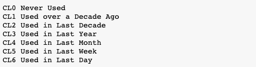
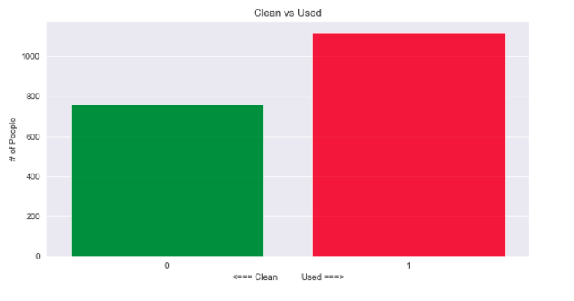
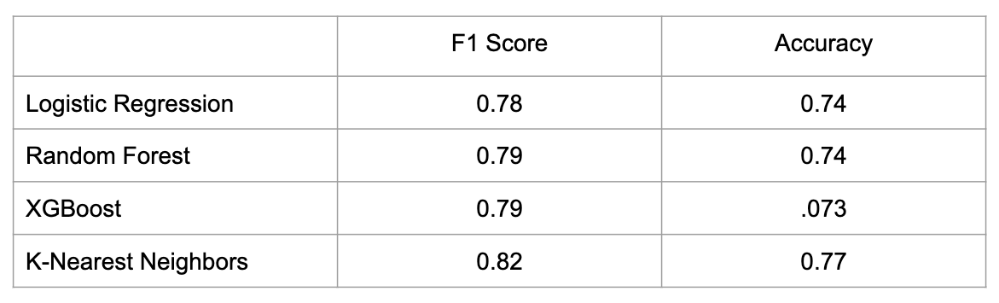
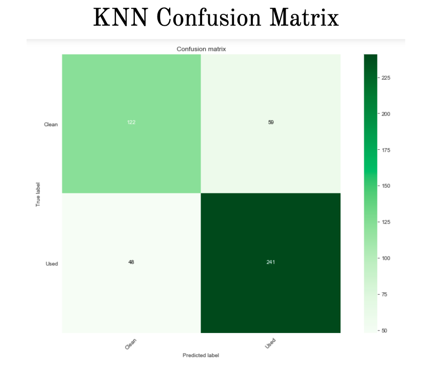

# Predicting Hard Drug Use 
## The Challenge: 
With the use surveyed drug consumption data that included demographics as well as personality inventory data, use classification models to predict the use of hard drugs. 
## The Data
**Demopgrapic data**
  * Age 
  * Gender
  * Education 

**Personality Inventory Data** 
  * **BIS-11(Barratt Impulsiveness Scale)** A questionnaire designed to assess the personality/ behavioral construct of impulsiveness. Four point scale ranging rarely/never to always. 
  * **NEO-PI(Neuroticism-Extraversion-Openness Personality Inventory)** Originally develop in the 1970’s by Robert McCrea and Paul Costa Jr it measure people’s big five personality traits. Consists of approximately 240 items (descriptions of behaviors) that are answered on a five point scale. 
  * **ImpSS(Sensation Seeking)** A common psychological instrument for measuring sensation seeking. Measurable outcomes include thrill and adventure seeking, disinhibition, experience seeking and boredom.
  
  **Drug Use Data**
  
  The original data set had columns for various drugs and denoted use for each observation as follows:
  
  
  ## The Approach
  With this in mind, the way I decided to define hard drug use was any observations of the use of amphetamine, benzos, cocaine, crack, ecstasy and heroin within the last decade, which split the data as follows:
  
  
**Features Included in the final models:**
  * Gender, Age, Education
  * Alcohol use within the last 30 days
  * Cannabis use within the last 30 days 
  * Personality Inventory Data 
  
**Results:**

As you can see the KNN model did the best job of correctly predicting whether or not someone used hard drugs with an F1 Score of 0.82 and an accuracy of 0.88 

